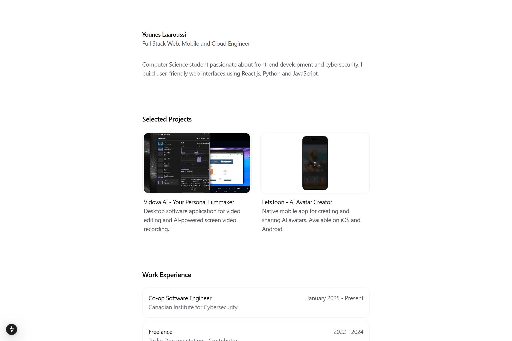

# TasteEngine

[](https://qloo.com/)
[](https://tidbcloud.com/)
[](https://nextjs.org/)
[](https://typescriptlang.org/)
[](https://docker.com/)

## The Cursor for Cultural Intelligence



Large Language Models trained on historical data miss fast-moving cultural shifts. TasteEngine bridges this gap by grounding agentic workflows in an authoritative cultural graph and a real-time data layer backed by TiDB Cloud Serverless + Vector Search.

This repository contains the production-ready app container and deployment configuration used for the hackathon demo site and API gateway edge integration. The agentic backend (orchestrator, Qloo adapter, web intelligence, and TiDB pipelines) is deployed as independent services; this README focuses on infrastructure and LLM orchestration—not on UI.

## Core Architecture Pillars

**1. Temporal Cultural Intelligence**  
Ground agents in current cultural signals via Qloo’s Taste AI™. Time-series endpoints like `trending` and deep-dive insights are cached and normalized before being written to TiDB for query and join operations.

**2. Zero-PII Cultural Analysis**  
Leverage anonymized preference graphs. No PII is stored or processed; only entity-level and cohort-level aggregates are persisted in TiDB.

**3. Multi-Agent Orchestration**  
A coordinator agent invokes specialized tools (Qloo lookups, trend analytics, web intel, RAG retrieval, vector search) across multiple steps to produce grounded, cross-domain insights.

**4. Authoritative Cultural Graph**  
Qloo serves as the ground truth for entity resolution and relationships. Results are materialized into TiDB tables for joins with web intel and private data sources.

**5. Enterprise Data Integration**  
Pipelines ingest documents, scraped content, and structured product feeds. Content is chunked, embedded, and indexed in TiDB Vector Search for retrieval during agent runs.

## Architecture: Services + Gateway Edge

Although this repo is the app container, the full system comprises:

- ai-orchestrator: Agent runtime, tool registry, tool-calling, streaming
- qloo-adapter: Authenticated proxy to Qloo APIs with caching and schema normalization
- web-intel: Dual-mode scraping (legacy + modern) with content extraction and image understanding
- data-pipeline: Ingestion workers writing normalized records and embeddings to TiDB Cloud
- gateway-edge (this repo’s container): Public entrypoint, static assets, and request routing to orchestrator

Inter-service communication is HTTP with signed requests. Long-running operations stream status updates to the client.

## Capability: Cross-Domain Cultural Analysis

Example multi-step flow (orchestrated server-side):

1) Resolve entities → Qloo `search_entities`  
2) Pull deep-dive insights with demographic filters  
3) Compare entity attributes across cohorts and regions  
4) Retrieve relevant web intel from TiDB vector index  
5) Synthesize grounded recommendations and return streaming updates

End-to-end execution typically completes in under 10 seconds with cached datasets.

## Quick Start

Prerequisites:
- Node.js 18+ or Bun 1.1+
- Docker (optional for containerized run)
- TiDB Cloud Serverless cluster (vector search enabled)
- Qloo API key

Local (dev):
```bash
bun install
bun run dev
# or
npm install
npm run dev
```

Production build:
```bash
bun run build && bun run start
# or
npm run build && npm run start
```

Docker:
```bash
docker build -t tasteengine .
docker run -p 3000:3000 --env NODE_ENV=production tasteengine
```

Railway (container deploy):
- Uses Dockerfile (see `railway.toml`), restart on failure with backoff.

Amplify (static hosting for Next output):
- See `amplify.yml` for Bun-based build steps.

## Data Pipeline with TiDB Cloud

- Ingestion: Normalize Qloo responses and scraped artifacts into staging tables
- Embedding: Compute vector embeddings for text chunks and store in TiDB Vector Search indexes
- Indexing: Maintain entity, relation, cohort, and content tables with foreign keys for joins
- Retrieval: Agent queries TiDB for relevant entities and performs hybrid search (vector + filters)
- Materialization: Frequently accessed joins are materialized to speed up multi-agent chains

Example logical schema (high-level):
- entities(entity_id, type, name, aliases, source)
- insights(entity_id, metric, value, cohort_key, ts)
- content(doc_id, entity_id, url, title, text, ts)
- content_chunks(chunk_id, doc_id, chunk_text, vector)
- cohorts(cohort_key, definition_json)

## Tool Orchestration Engine

- Tool registry defines Qloo endpoints, web-intel actions, TiDB query templates
- Coordinator loops up to N steps, selecting next tool based on grounded signals
- Results are truncated/summarized server-side to fit context and reduce costs
- Errors degrade gracefully with retries and cached fallbacks

Qloo Intelligence Tools (examples):
- Entity Resolution: `search_entities`, `get_entities_by_id`
- Audience & Insights: `find_audiences`, `get_insights_deep_dive`, `compare_insights`
- Trends: `get_trending`, `analyze_entities`
- Taxonomy & Geo: `search_tags`, `get_tag_types`, `geocode_location`

Web Intelligence Tools (examples):
- `scrape_url`, `scrape_browser`, `extract_schema`, `search_similar_content`

TiDB Data Tools (examples):
- `vector_search_chunks`, `hybrid_search_entities`, `get_entity_joined_view`

## Streaming & Reliability

- Server-sent events for: connection, tool_call, tool_result, message, status
- Caching strategy: tiered (memory → Redis → TiDB materialized views)
- Backpressure: agent truncates large tool outputs and summarizes oversized payloads
- Observability: structured logs with timings per tool and query

## Development & Testing

- Local dev runs the app and connects to remote orchestrator endpoints
- Integration tests cover tool selection and TiDB query templates
- CLI utilities (external) can invoke specific tools and compare outputs vs cached results

## Technical Specs

- App: Next.js 15 + TypeScript, built with Bun or Node
- Container: Multi-stage Dockerfile using Bun base image
- Deploy: Railway (Docker), AWS Amplify (static hosting) supported
- Data: TiDB Cloud Serverless with Vector Search for embeddings and hybrid queries
- Intelligence: Qloo endpoints for cultural graph grounding

Performance targets (typical under cache):
- Tool chain latency: < 10s end-to-end
- Streaming event cadence: < 100ms per event on LAN
- Cache hit rate: > 80% for repeated entity insights

## Commercial & Compliance

- Zero-PII: Only entity/cohort aggregates are stored; no user-level identifiers
- Regionalization: Deploy per-region TiDB clusters if data residency is required
- Cost control: Cache-first reads, summarized tool outputs, and compact chunking

## Repository Structure

```
app/                 # Next.js app (routing, assets, static site)
components/          # UI components (not central to infra/LLM)
hooks/               # UI hooks
lib/                 # Utilities (client-side)
public/              # Static assets (cover image, icons)
Dockerfile           # Multi-stage, Bun-based production container
railway.toml         # Container deploy settings (restart policy)
amplify.yml          # Bun build pipeline for Amplify hosting
```

## Run Instructions (for Judges)

1) Provision TiDB Cloud Serverless and enable vector search. Note the connection string and credentials.  
2) Obtain a Qloo API key.  
3) Configure your backend orchestrator with these credentials and expose HTTP endpoints.  
4) Build and run this app container (above) and configure it to target your orchestrator base URL (via your deployment platform’s environment config or reverse proxy).  
5) Open the site and run a multi-step cultural analysis query (agent will chain Qloo + TiDB + web intel tools and stream results).

Submission checklist:
- Include the TiDB Cloud account email used for the project
- Public repository access granted to judges
- Short summary of data flow and integrations (this README)
- Run instructions (this section)
- 4-min demo video link showing end-to-end agent run

## Roadmap

- Add MCP-compatible tool adapters for standardized function execution
- Expand TiDB hybrid search templates for common cultural joins
- Add queue-backed retry for long-running scrapes with status streaming
- Extend cohort definition DSL and validation

---

Questions? Open an issue and we’ll help you get set up quickly for review.
